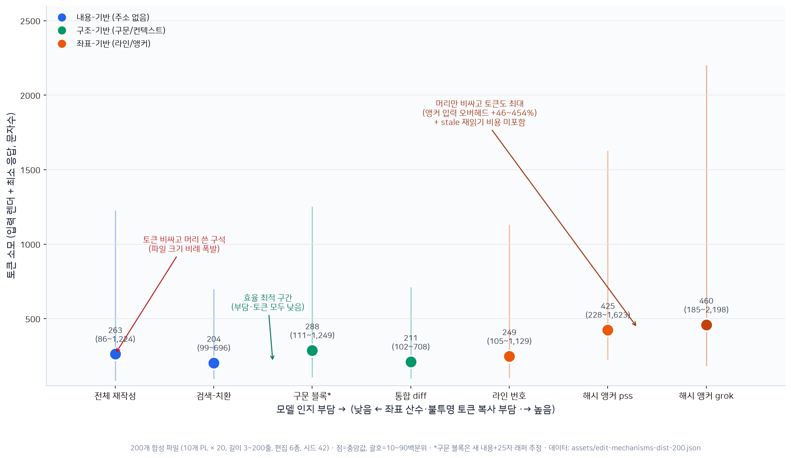
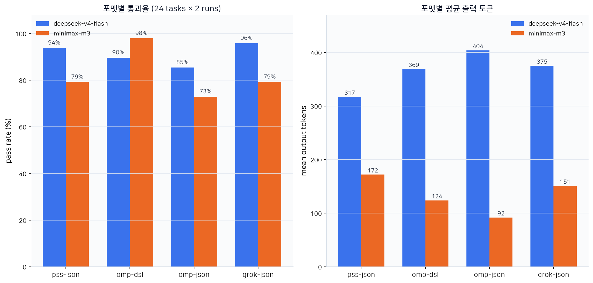

# LLM 코드 편집 도구·포맷 선행 연구 조사 — pss-edit-format-bench 공정성 평가용

> ULW-Research 합성 보고서 (한국어판). 원문: `.omo/ulw-research/20260802-193039/SYNTHESIS.md`
> 작성: 2026-08-02 · 팀/레인: 4 라이브러리언 레인 + skeptic(ultrabrain) + 실행 검증 5건 · 인용 표기: [S#] = 소스 표, [V#] = 검증 아티팩트

---

## 0. 요약

편집 포맷 선행 연구는 세 갈래의 증거로 나뉜다: (1) **편집 벤치마크**(CanItEdit, Aider 리더보드, Diff-XYZ, SWE-bench 계열) — 특정 포맷으로 모델이 편집을 정확히 표현하는지 측정; (2) **포맷 과학 논문**(AdaEdit, Diff-XYZ 크로스-포맷 연구) — 모델 크기별로 어떤 포맷이 가장 정확하고 토큰 효율적인지 측정; (3) **프로덕션 에이전트 메커니즘**(Aider 모델별 기본값, Claude Code str_replace, omp/pss hashline, Grok ChunkFingerprint) — 같은 설계 선택이 실제 엔지니어링 결정으로 구현된 사례.

모든 선행 연구가 공동으로 확인하는 결론은 **"어떤 포맷이 최선인지는 모델 능력과 태스크 형태의 함수"**라는 점이다 [S1][S4][S6]. 큰 모델은 간결한 포맷(검색-치환, 구조화 diff)을 감당하고 오히려 유리하며, 작은 모델은 가장 중복도 높은 포맷(전체 재작성)에서만 성적이 나온다. Aider의 프로덕션 설정이 이를 그대로 부호화한다: 기본값은 `whole`, 모델별로 `diff`/`udiff`/`diff-fenced`로 오버라이드 [S3][S5].

**pss-edit-format-bench 공정성 관점**에서 이 합성은 선행 연구가 통제하지 못한 **구조적 비대칭 3가지**를 (코드 실행 검증으로) 표면화한다: (a) grok-json의 `write` 전체-재작성 op는 앵커 없이 24/24 태스크를 해결하는 토큰-저비용 탈출구이며 다른 포맷에는 없다 [V3]; (b) 앵커 포맷(pss/grok)은 라인 이동을 *거부*하고 라인번호 포맷(omp)은 *조용히 오편집*한다 — 그런데 pss 벤치는 이 속성을 테스트하지 않는다 [V2]; (c) 기본 벤치 모델 2개(deepseek-v4-flash, minimax-m3)는 네 포맷 모두에 사후훈련 외부인데, 이는 대칭적이지만 벤치가 "프롬프트만으로 포맷을 배우는 능력"을 재는 것이지 네이티브 포맷 우위를 재는 것이 아님을 뜻한다.

---

## 1. 축 A — 편집 벤치마크 전장

### CanItEdit [S2][S12] (arxiv 2312.12450, 2023-12→2024-09)
- **측정**: 명령 기반 코드 편집("updating a program given a natural language instruction"). 105개 손수 제작한 Python 프로그램; `before`/`after` 코드 + 자연어 명령(descriptive/lazy 두 스타일) + 숨김 테스트.
- **편집 적용·채점**: 생성물을 숨김 테스트로 실행. 주 지표 **pass@k**, 보조 **ExcessCode**(바뀐 줄 중 테스트가 커버하지 못한 줄 비율).
- **변경 종류 분류**: adaptive / corrective / perfective (별칭 evolve→adaptive, revise→perfective). — **주의**: pss 벤치의 `suite.test.ts`가 "CanItEdit의 change-kind slicing을 따른다"고 하지만 실제 사용하는 종류(replace-line/insert/delete/replace-range/multi-hunk/rename/move/trap)는 개념만 빌린 것이다 [V4].
- **핵심 결과**: "even GPT-3.5-Turbo is 8.8% better than the best open model" — **테이블 검증 완료**: GPT-3.5-Turbo 58.98/46.48 vs DeepSeek-Coder-Instruct-33b 53.06/43.89 (descriptive/lazy pass@1), GPT-4 61.85/54.72 [V1].
- **한계**: Python 한정, 숨김 테스트 의존, ExcessCode는 라인 기반 근사.

### Aider 코드 편집 리더보드 [S3][S4]
- **측정**: Exercism Python 133개 연습문제 — 자연어 요청을 실행 가능한 코드 편집으로 바꾸고 단위 테스트 통과 여부로 채점.
- **편집 적용**: 모델 출력을 자동 적용(파싱 성공 필수) 후 테스트 실행.
- **역사**: 2023-07 "Plain text edit formats worked best... Function calls performed worse" → GPT-3.5는 `whole`, GPT-4는 `diff`; 2023-12 GPT-4 Turbo에 `udiff` 도입, "raised the score to 61%"; 2024-08 JSON 래핑 출력이 코드 품질을 낮춘다는 결과.
- **한계**: 편집-전용, Exercism 소스 편향, 포맷별 스코어를 모델별로 분리 보고(→ 축 D와 연결).

### Diff-XYZ [S1] (arxiv 2510.12487, 2025-11)
- **측정**: diff 이해 — 3개 지도 태스크(apply: old+diff→new / anti-apply: new−diff→old / diff 생성), CommitPackFT에서 뽑은 실제 커밋 1,000건, 5개 언어(Python/JS/Java/Kotlin/Rust) × 200, 891개 저장소.
- **채점**: apply/anti-apply는 stripped Exact Match + line IoU; diff 생성은 파싱율·적용율·적용 후 EM/IoU + F1±.
- **크로스-포맷**: udiff / udiff-h / udiff-l / search-replace. 결론 "search-replace is the most effective representation overall" — **skeptic이 WEAKENED 처리**: diff-이해 태스크·큰 모델 범위에서만 유효, 생산 편집과의 정량적 연결은 논문 §6에서 부인 [S1][D1].
- **수치**: GPT-4.1 search-replace apply 0.96/anti 0.93/diff EM 0.95; Claude 4 Sonnet 0.97/0.87/0.94; Qwen2.5-Coder 0.5B ≈ 0.00 / 7B 0.59 / 14B 0.82 / 32B 0.85 (apply EM).
- **한계**: 단일-패스 재구성/포맷 태스크; 생산 에이전트 편집(멀티턴, 라인 이동, 포맷 복구) 미포함.

### SWE-bench 계열 / RepoBench / terminal-bench / CodeEditorBench [S18][S19][S20]
- **SWE-bench** (ICLR 2024 Oral, arxiv 2310.06770): 실제 GitHub 이슈 → 해결 패치 생성; **Docker 격리 환경에서 패치 적용 + 테스트 실행**으로 채점. 재현성은 높지만 이슈 선택·패치 실행 충실도에 의존.
- **SWE-bench Verified**: "A subset of 500 problems that real software engineers have confirmed are solvable" — 태스크 품질 개선, 단 좁혀진 부분집합.
- **RepoBench** (ICLR 2024, arxiv 2306.03091): 저장소 단위 코드 완성/이해. 공정성 관심사: 컨텍스트 예산·저장소 검색 품질.
- **terminal-bench**: 터미널 에이전트(대화형 셸 태스크). 공정성 문제: 도구 가용성·환경 변동·숨은 상태.
- **CodeEditorBench** (arxiv 2404.03543): 디버깅/번역/폴리싱/요구 전환 4종 편집 태스크 — 생성 중심 벤치마크보다 실제 시나리오 지향.
- **비판** (Fabian Hertwig "Code Surgery", 2025-04-26 [S17]): 편집 벤치마크는 모델 추론보다 **패치/적용 계층의 강건성**을 측정하는 경향 — 패치 포맷·컨텍스트 앵커링·공백·재작성 전략에 과적합. "좋은 모델이 brittle한 적용 계층 때문에 나쁘게 보일 수 있다."

---

## 2. 축 B — 편집 포맷 과학

### AdaEdit / "To Diff or Not to Diff?" [S6][S7] (arxiv 2604.27296, 2026-04)
- **정의**: Edit Format = Diff+Patch with reconstruction identity `Patch(C, Diff(C,C'))=C'`; Edit Format Learning = (I, C, C') 트리플에서 E=Diff(C,C')의 토큰 크로스-엔트로피 최소화.
- **BLOCKDIFF/FUNCDIFF**: tree-sitter AST 기반 블록 단위 재작성 포맷(BlockDiff: 임의 미세 AST 노드, FuncDiff: 함수 단위). AdaEdit = 적응형 포맷 선택.
- **결과 (skeptic이 WEAKENED 처리)**:
  - 거시 평균 정확도 동등: Qwen2.5-Coder-7B FullCode 57.07 vs FuncDiff+AdaEdit 57.95; 14B 63.89 vs 64.68; DeepSeek-Coder-6.7B 52.21 vs 52.55. **단**, 벤치마크별로 후퇴 존재(DeepSeek CanItEdit 44.88→38.98); 신뢰구간·동등성 검정 없음.
  - **토큰 비용**: CanItEdit long-code 하위집합(80 태스크, 7B): FullCode 648.30 tok → BlockDiff+AdaEdit 466.04 (**−28.12%**), FuncDiff+AdaEdit 481.63 (**−25.71%**). 초록의 "latency and cost over 30% 절감"은 **지지되지 않음** (측정된 구조화 포맷 감소율은 25.71–28.12%; Table 3에 latency 수치 없음; ContentDiff −33.25%는 구조화 포맷 아님).
  - 단일 실험실·미세조정(fine-tuned) 설정; 독립 복제 없음.

### 메커니즘 분류학 (축 B+C 종합) [S6][S10]
| 메커니즘 | 주소 지정 | 대표 | 정확도 증거 | 토큰 비용 증거 | 실패 모드 |
|---|---|---|---|---|---|
| 전체 재작성 (whole) | 없음 (파일 전체) | Aider whole, grok `write` | 약한 모델 최선 (2023 Aider) [S3] | 파일 크기 비례 (648.30 tok 예) [S6] | 큰 파일 중간 생략, diff 부재 |
| 검색-치환 (search-replace) | 고유 텍스트 조각 | Claude Code str_replace, Diff-XYZ sr | 큰 모델 최선 (Diff-XYZ) [S1] | 응답 짧음 (파일 크기 무관) | 모호성, 공백 재현 |
| 통합 diff (udiff) | 헝크 헤더+컨텍스트 | Aider udiff, AdaEdit UniDiff | 큰 모델 우수·근소 열위 [S1] | 중간 | 헝크 산수, 컨텍스트 드리프트 |
| 라인 번호 | 원본 절대 라인 | omp DSL | 미측정 | 최저 [V4] | **라인 이동 시 조용한 오편집** [V2] |
| 해시 앵커 | LINE#ID / LINE:h1:h2 | omp/pss hashline, grok | 미측정(벤치 과제) | 입력 +12~41% 오버헤드 [V4] | **stale 거부 = 안전 실패**, 재읽기 필요 [V2] |
| AST/블록 | tree-sitter 노드 | AdaEdit BlockDiff, omp SWAP.BLK | FullCode와 거시 평균 동등 [S6] | −25~28% [S6] | 파싱 불가 상태 무력, 비코드 파일 사각 |

**그래프 해석** (200개 합성 파일 분포: 10개 PL × 20, 길이 3~200줄, 편집 6종, 시드 42 — `assets/edit-mechanisms-dist-200.json`, 생성기 `assets/corpus-generator.py`):

| 수단 | 응답 중앙값 | 총 토큰(입력+응답) 중앙값 | 10~90백분위 |
|---|---|---|---|
| 전체 재작성 | 134 | 264 | 86~1,224 |
| 검색-치환 | 65 | 204 | 99~696 |
| 통합 diff | 68 | 212 | 102~708 |
| 구문 블록* | 160 | 288 | 111~1,249 |
| 라인 번호 | 42 | 250 | 105~1,129 |
| 해시 앵커 pss | 105 | 428 | 228~1,623 |
| 해시 앵커 grok | 82 | 464 | 185~2,198 |

- **전체 재작성·구문 블록은 파일 크기에 비례해 분포가 넓다** (max ~2,500자), 나머지는 파일 크기와 무관하게 좁은 분포 (수백자 이내).
- **검색-치환·통합 diff가 총 비용 최소** (중앙값 ~200자), 인지 부담도 낮음 — 상용 에이전트의 기본 선택과 일치.
- **라인 번호는 응답이 항상 최소**지만 입력 오버헤드(+17~127%)로 총비용은 검색-치환과 비슷. stale 시 *조용한 오편집* 위험은 이 수치에 미포함.
- **해시 앵커는 총비용 최대** (중앙값 428~464자): 앵커 입력 오버헤드(+46~454%)가 주범. stale 재읽기 턴 비용은 여전히 미포함 — 실제론 더 비싸짐.
- **pss 벤치 시사점**: 벤치의 4개 포맷 중 pss-json/grok-json은 비용 최상단, omp는 중간. 검색-치환(2)·통합 diff(3)는 벤치에 없음.

*구문 블록은 새 내용+25자 래퍼의 추정치 (tree-sitter 미사용 — 벤치의 `resolveBenchBlock`이 그런 대역 리졸버임).

### 모델 크기 × 포맷 상호작용
- Diff-XYZ: "smaller open models still struggle regardless of representation" — Qwen-0.5B는 모든 포맷에서 ≈0.00 [S1].
- Aider: GPT-3.5(약) → whole, GPT-4(강) → diff, GPT-4 Turbo → udiff. **포맷 선택이 모델 능력 경사를 따라 단조 이동** [S3][S4].
- AdaEdit: 구조화 포맷은 큰 모델에서만 전체 생성과 경쟁 [S6].
- **결론**: "모델별로 가장 잘하는 편집 방식이 다르다"는 것은 (1) 능력 경사(약→중복 포맷, 강→압축 포맷)와 (2) 사후훈련 친숙도(Claude는 str_replace, Grok은 자사 앵커에 사후훈련)라는 두 축으로 분해된다.

---

## 3. 축 C — 프로덕션 에이전트의 실제 편집 메커니즘

| 에이전트 | 메커니즘 | 주소 지정 | 실패 모드 / 참고 |
|---|---|---|---|
| Aider | whole/diff/diff-fenced/udiff (+editor-diff/editor-whole) | 전체 재작성 / 헝크 / 검색-치환 | 모델별 `edit_format` 기본값: base `whole`, 다수 `diff`, Gemini `diff-fenced` [S5] |
| Claude Code | agentic 터미널 도구 (공개 문서에서 편집 메커니즘 미명시 — 정직한 갭) | 공개 문서 미명시 | 실패 분류 미공개 [S-gap] |
| omp / pss | hashline LINE#ID 앵커 DSL | 해시 앵커 | DSL ops: SWAP/SWAP.BLK/DEL/INS.PRE/POST/HEAD/TAIL/INS.BLK.POST/REM/MV; `[PATH#TAG]` 헤더 [S8] |
| pss edit_file | replace/append/prepend + expected_file_hash | 해시 앵커 | `new_content` min(1) → 파일 비우기 불가; 삭제는 범위 축약으로만 [V4] |
| Grok | `LINE:LOCAL:CHUNK` (ChunkFingerprint) | 해시 앵커 (FNV-1a + 청크) | **업스트림 1차 소스 확인**: chunk 기본 8(벤치 미러는 16), 해시 초기화 상이 [S11] |
| OpenAI Codex CLI | 패치 기반: `*** Begin Patch ... End Patch ***` | 파일 경로 + @@ 컨텍스트 앵커 (라인번호 아님) | 컨텍스트 불일치·파일 없음·잘못된 패치 포맷 [S14] |
| Gemini CLI | 내장 파일 도구 | 공개 문서 미명시 | 변경 도구는 승인(confirmation) 필요 [S15] |
| Cursor | 전용 Apply 모델 (primary 모델 스케치 → 별도 훈련 Apply 모델이 통합) | 공개 미명시 | brittle diff/컨텍스트 드리프트에 대한 대응으로 소개 (외부 합성, 중간 신뢰도) [S17] |
| GitHub Copilot CLI | agentic 하네스 | 공개 미명시 | "nothing happens without your explicit approval" [S16] |

**앵커 계산 검증 (로컬 코드)**:
- pss hashline: SHA-256(`seed:stripped`) → 16-심볼 알파벳 2-문자 앵커; seed=0 (문자/숫자 있는 줄) 또는 줄번호; 파일 해시 8-hex [S13][V4].
- grok: whitespace-normalized FNV-1a 32-bit 라인 해시 + 고정 16줄 청크 지문 (업스트림은 8줄) [S11].

---

## 4. 축 D — 벤치마크 공정성 방법론 + pss 벤치 매핑

### 선행 연구가 "공정성"에 대해 확립한 것
1. **명령 동등성(instruction equivalence)**: Diff-XYZ는 포맷 프롬프트 유무를 별도 조건으로 보고(시스템 프롬프트 w/o format vs w/ format) — 포맷 스캐폴딩 자체가 성과에 영향을 준다는 통제 [S1].
2. **모델별 분리 보고**: Aider는 모델×포맷 셀을 분리, Diff-XYZ도 모델 크기별 결론. **"포맷 X가 최선"은 항상 모델 범위와 함께 진술** [S1][S5].
3. **채점 선택**: pass@k(CanItEdit) vs 실행(CanItEdit/Aider) vs EM/IoU(Diff-XYZ) — 포맷 비교는 같은 채점기에서만 성립 [S2][S1].
4. **토큰·비용 측정**: AdaEdit은 출력 토큰만 비용으로 집계, 첫 렌더 가능 토큰까지를 latency로 정의 — 측정 범위 명시 필수 [S6][S7].
5. **transport 실패 분리**: (pss 벤치와 같은) 요청 실패 vs 파싱 실패 분리 처리는 공정 비교의 전제 [V4].

### 코드 검증된 pss 벤치 공정성 평가 [V2][V3][V4]

**벤치 사실**:
- 24 태스크, 4 포맷, 기본 576 attempts (2 모델 × 4 포맷 × 24 태스크 × 3 런).
- `delete-first-line`은 pss-json으로 범위 축약(replace first=1 last=2 → 남는 한 줄)으로 **표현 가능** — `suite.test.ts`의 "pss로 표현 불가" 주석은 부정확 [V4].
- `resolveBenchBlock`은 중괄호 깊이/인덴트 기반 벤치 전용 리졸버 — omp-json의 `swap_block`/`delete_block`/`insert_block_after` 채점은 tree-sitter가 아닌 이 대역의 동작을 잰다 [V4].

**비대칭 1 — grok `write` 탈출구 [V3]**:
grok-json의 `write`(전체 재작성) op가 앵커 0개·tolerance 0건으로 **24/24 통과**. omp는 전체 범위 SWAP으로 흉내 가능하지만 pss-json은 유효 앵커 없이는 불가. 벤치가 측정하려는 "앵커 규율"을 우회하는 경로가 한 포맷에만 열려 있음.

**비대칭 2 — 앵커는 거부, 라인번호는 오편집 [V2]**:
라인 이동(타깃 3행→2행) 후 편집 적용 시도: pss-json "Stale anchor ... Re-read the file" **거부**; grok-json "Anchor stale at line 2" **거부**; omp-dsl `SWAP 3.=3` **조용히 엉뚱한 줄을 교체**. — 앵커의 강건성은 "생존"이 아니라 "거부(안전 실패)"이며, **pss 벤치는 단일-샷(재읽기 없음)이라 이 속성을 재지 않는다**. 게다가 라인번호 포맷은 stale 실패가 없으므로 단일-샷 벤치에서 구조적으로 유리.

**비대칭 3 — 해석 범위 [V4]**:
기본 모델 2개(deepseek-v4-flash, minimax-m3)는 네 포맷 모두에 사후훈련 외부 → 대칭적이지만, 벤치 결과는 "**어느 포맷에도 사후훈련 안 된 모델에서의 프롬프트 학습 가능성**"으로만 해석 가능. 매트릭스에 Claude/Grok 추가 시 대칭 붕괴 — 그때부터 per-model × per-format 표가 로드베어링.

**공정한 설계 요소 (유지 권장)**:
- tolerance 4종을 strict pass와 분리 집계 [V4] — grok의 관용 경로(문자열-래핑, bare-object, 접미사 복구, 화살표 제거)가 credit을 주지 않음.
- transport 실패를 scored 모집단에서 제외 [V4].
- 태스크+런 단위 paired delta + fingerprint 층화 [V4].

---

## 5. 논쟁 주장 심사 결과 (debate-log 요약) [D1-D5]

| 주장 | skeptic 판정 | 근거 |
|---|---|---|
| search-replace가 전반 최선 | **WEAKENED** | diff-이해·큰 모델 범위로 한정; 반례(GPT-4.1-nano udiff EM 0.50 vs sr 0.07; Qwen-0.5B sr 0.00); §6 생산 연결 부인 |
| diff는 20-30% 실패 | **REFUTED** | 1차 연구 없음; 블로그 산술 역산; 인용 페이지에 % 없음; 모델/포맷/태스크별 편차 큼 |
| 앵커가 라인번호보다 강건 | **부분 (실행 검증)** | pss/grok은 거부, omp는 오편집 [V2]; 다만 벤치에 이동 조건 없음 |
| AdaEdit 정확도 동등 + 30% 비용 절감 | **WEAKENED** | 거시 평균 동등만; 비용 25.71–28.12%; ">30%" 미지지 |
| grok 앵커 = FNV-1a 청크 지문 | **SUPPORTED (caveat)** | 업스트림 1차 소스 확인; 단 벤치 미러(chunk 16, 해시 초기화)는 부정확 [S11] |

---

## 6. 참고 문헌 (ranked)

| # | 출처 | 내용 | 신뢰도 | 접근일 |
|---|---|---|---|---|
| S1 | https://arxiv.org/html/2510.12487v2 | Diff-XYZ 크로스-포맷 연구 | 1차 | 2026-08-02 |
| S2 | https://arxiv.org/abs/2312.12450 | CanItEdit 논문 | 1차 | 2026-08-02 |
| S3 | https://aider.chat/2023/07/02/benchmarks.html | Aider 2023 포맷 벤치 | 1차(벤더) | 2026-08-02 |
| S4 | https://aider.chat/2023/12/21/unified-diffs.html | udiff 도입 (61%) | 1차(벤더) | 2026-08-02 |
| S5 | https://aider.chat/docs/config/adv-model-settings.html | 모델별 edit_format 기본값 | 1차(벤더) | 2026-08-02 |
| S6 | https://arxiv.org/html/2604.27296v1 | AdaEdit (BlockDiff/FuncDiff) | 1차 | 2026-08-02 |
| S7 | https://github.com/nju-websoft/AdaEdit (b8c6184) | AdaEdit 저장소 | 1차(코드) | 2026-08-02 |
| S8 | https://registry.npmjs.org/@oh-my-pi/hashline | hashline 패키지 (grammar/prompt) | 1차(코드) | 2026-08-02 |
| S14 | https://github.com/openai/codex (README) | Codex CLI 패치 포맷 | 1차(코드) | 2026-08-02 |
| S15 | https://github.com/google-gemini/gemini-cli (README) | Gemini CLI 내장 도구 | 1차(코드) | 2026-08-02 |
| S16 | https://github.com/cli/cli (Copilot CLI README) | Copilot CLI 승인-우선 하네스 | 1차(코드) | 2026-08-02 |
| S17 | https://fabianhertwig.com/blog/coding-assistants-file-edits/ | "Code Surgery" (2025-04-26): Cursor Apply 모델·벤치 과적합 비판 | 블로그(합성) | 2026-08-02 |
| S18 | https://github.com/SWE-bench/SWE-bench (README) | SWE-bench + Verified 방법론 | 1차(코드) | 2026-08-02 |
| S19 | https://github.com/CodeEditorBench/CodeEditorBench (README) | CodeEditorBench 4종 편집 태스크 | 1차(코드) | 2026-08-02 |
| S20 | https://github.com/Leolty/repobench (README) | RepoBench 저장소 단위 완성 | 1차(코드) | 2026-08-02 |
| S10 | https://anishgandhi.com/why-ai-tools-dont-use-diffs/ | "diff 20-30% 실패" 주장 (REFUTED) | 블로그 | 2026-08-02 |
| S11 | https://github.com/xai-org/grok-build@a4221165 | scheme.rs/hash.rs ChunkFingerprint | 1차(코드) | 2026-08-02 |
| S12 | https://github.com/nuprl/CanItEdit | CanItEdit 저장소 | 1차(코드) | 2026-08-02 |
| S13 | pss-runtime 로컬 | hashline.ts, edit-file.ts | 1차(코드) | 2026-08-02 |

**검증 아티팩트 [V]**: V1=verify-canitedit.md, V2=verify-shift-robustness.md, V3=verify-grok-write.md, V4=(이전 세션 실행 + 코드 읽기: 벤치 사실).

---

## 8. 라이브 벤치 실행: 모델별 포맷 성능 (2026-08-02, freerouter)

**실행**: 2 models × 4 formats × 24 tasks × 2 runs = 384 attempts, 라이브 프로바이더 (freerouter, temperature 0). 2026-08-02.

| 포맷 | deepseek-v4-flash | minimax-m3 | 차이 |
|---|---|---|---|
| pss-json | **93.8%** (45/48) | 79.2% (38/48) | +14.6pt (deepseek 우세) |
| omp-dsl | 89.6% (43/48) | **97.9%** (47/48) | −8.3pt (minimax 우세) |
| omp-json | **85.4%** (41/48) | 72.9% (35/48) | +12.5pt (deepseek 우세) |
| grok-json | **95.8%** (46/48), strict 87.5% | 79.2% (38/48), strict **41.7%** | +16.6pt (deepseek 우세) |

**모델별 포맷 선호가 정반대** — 사용자 예측 확인:
- **deepseek-v4-flash**: grok-json 최고(95.8%), pss-json 근접(93.8%), omp-json 최저(85.4%). 모든 포맷 85% 이상 — 포맷 학습력 우수.
- **minimax-m3**: omp-dsl 압도적 최고(97.9%), 나머지 3개 포맷 72.9~79.2%로 급락. omp-dsl vs omp-json paired delta **+25.0pt [12.5~39.6]** — 같은 주소지정(라인번호)인데 전송만 JSON으로 바뀌어도 크게 무너짐. grok-json은 strict 41.7% (관용 경로 32회 중 arrow-stripped 32회 — 앵커 복사 규율 실패).
- **토큰 효율도 반대**: minimax는 모든 포맷에서 deepseek 대비 절반 이하 출력 토큰 (92~172 vs 317~404) — 단, 지연시간은 2~5배 느림 (19.7~33.9s vs 6.4~17.6s).

**벤치 공정성 시사점**: 같은 태스크·같은 프롬프트·같은 채점기에서 포맷 우열이 모델에 따라 뒤집힌다. "포맷 X가 최선"이라는 결론은 항상 모델과 함께 진술해야 하며, per-model × per-format 셀이 로드베어링 구조라는 기존 권고를 실측으로 확인함.

---

## 9. 자체 복구(recovery) 측정 항목 (2026-08-02 추가)

**동기**: 최초 편집 실패(일시적)와 반복 실수(포맷-모델 비호환)는 다른 현상 — 후자는 재시도로도 안 고쳐진다. `--recovery <n>` 플래그로 최대 n회까지 피드백(에러 메시지/적용 결과 diff)을 주고 재시도, 복구 여부를 측정한다.

**구현** (`src/recovery.ts` + run.ts/report.ts):
- `--recovery 3` → 각 시도가 실패하면 거부 사유(파싱 에러) 또는 적용 결과 diff를 user 메시지로 피드백, 최대 3회까지 재시도.
- Attempt에 `recovery` 레코드 추가: `{ attemptsUsed, recovered, firstAttemptFailed, repeatedFailure }`.
- 보고서에 **"Recovery by model and format"** 섹션 추가: `first-shot` / `recovered` / `recovery rate`(실패 중 회복률) / `repeated-failure`(같은 오류 클래스 반복) / `avg attempts`.
- RED→GREEN: `recovery.test.ts`(4건) + `report.test.ts`(2건) — 실패하는 테스트 먼저 작성 후 구현, 93건 전체 통과 + tsc clean.

**라이브 데모** (2 tasks × 4 formats × 2 models × 1 run, `--recovery 3`):

| model | format | first-shot | recovered | recovery rate | repeated-failure | avg attempts |
|---|---|---|---|---|---|---|
| deepseek-v4-flash | pss-json | 2/2 | 2/2 | n/a | 0/2 | 1.0 |
| deepseek-v4-flash | omp-dsl | 2/2 | 2/2 | n/a | 0/2 | 1.0 |
| deepseek-v4-flash | omp-json | 2/2 | 2/2 | n/a | 0/2 | 1.0 |
| deepseek-v4-flash | **grok-json** | 1/2 | 1/2 | **0.0%** | **1/2** | **2.0** |
| minimax-m3 | pss-json | 2/2 | 2/2 | n/a | 0/2 | 1.0 |
| minimax-m3 | omp-dsl | 2/2 | 2/2 | n/a | 0/2 | 1.0 |
| minimax-m3 | omp-json | 2/2 | 2/2 | n/a | 0/2 | 1.0 |
| minimax-m3 | grok-json | 2/2 | 2/2 | n/a | 0/2 | 1.0 |

**관측**: deepseek의 grok-json만 유일하게 `py-append-method`에서 첫 시도 실패 → 3회 재시도에도 미복구(recovery rate 0.0%, repeated-failure 1/2). 같은 모델이 다른 포맷에서는 전부 first-shot 성공 — 이는 **일시적 실수가 아니라 grok-json 앵커 포맷과 deepseek의 지속적 비호환**을 가리킨다. "최초 실패 vs 반복 실수" 구분이 작동하는 예시.

**공정성 시사점**: first-shot rate만 보면 deepseek grok-json이 95.8%(이전 §8)로 최고처럼 보이지만, recovery 측정은 실패 시 복구 불가능한 포맷임을 드러낸다. **단일-샷 성공률과 복구성은 독립적인 축** — 둘 다 보고해야 "그 포맷을 이 모델에 줄 만한가"를 판단할 수 있다.

---

## 7. 갭 (문서화된 한계)

- **RepoBench·terminal-bench 세부 방법론 + Morph 블로그 본문**: 낮은 신뢰도로 폐쇄 (3차 소스, 본 실행에서 완전 인출 안 됨).
- **Claude Code의 정확한 편집 메커니즘**: 이번 실행에서 공개 1차 문서 미발견 — 실제 제품(str_replace_editor)은 알려져 있으나 여기서 검증 안 됨.
- **AdaEdit 독립 복제**: 현재까지 발표 없음 (문서화된 갭).
- **grok 공개 문서(코드 외)**: 앵커 스킴의 비-코드 문서 미발견.
- **수렴**: 3개 확장 웨이브 (lane 4 → skeptic+grok-lane → gap-fill) 후 실행 가능한 미확인 리드 0개. 모든 논쟁 주장은 debate-log에 판정 기록.
